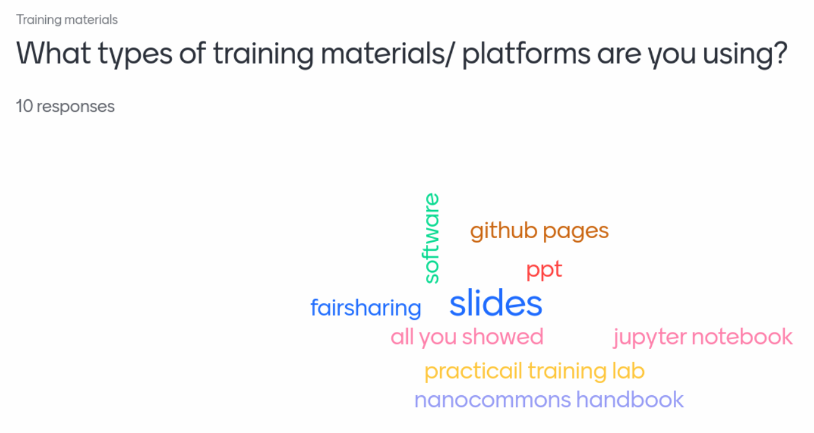

# Introduction

As part of the INTOXICOM Implementation Study for the ELIXIR Toxicology Community a series of workshops is organized. The first INTOXICOM workshop was held in May 2024
[@citesAsRecommendedReading:citesAsEvidence:Martens2024INTOXICOM]. Here,
we here report on the 2nd workshop, titled "Enhancing Research Output: FAIR documentation and Tool Management for
toxicology studies" which was held from 27 to 28 November 2024 at the Main Building
of the University of Basel in Switzerland.

A team of ELIXIR Toxicology Community participants, including Marvin Martens, Danyel Jennen, Meike Bünger, Rob Stierum, Thomas Exner, Egon Willighagen, coordinated the event. Four experts were invited to
join the event: Sara Morsy (Training Platform, UK), Christian Bonatto Minella (FIZ Karlsruhe, DE), Kryštof Komanec (DS-Wizard, CZ), and Vassilios Ioannidis (FAIR Cookbook).

# The workshop

This workshop was a face-to-face, free-of-charge hands-on workshop
with the target audience being toxicologists with interest in using FAIR
data resources for their research or making their data FAIR, as well as data managers and
researchers working with Adverse Outcome Pathways (AOPs). It had 17 participants, 
12 in-person and 5 online. The participants represented a diverse set of organisations,
including universities (University of Bradford, University of Birmingham, Masaryk University,
University of Liege, University of Tartu, University of Plovdiv, Czech Technical University,
and Maastricht University), as well as research institutes (TNO, SIB, RIVM, FIX Karlsruhe)
and companies (Seven Past Nine GmbH). Additionally, representatives from regulatory bodies,
projects, and various ELIXIR Platforms participated.
Geographically, the workshop had attendees from The Netherlands, the UK, Germany, Czechia,
Belgium, Estonia, Bulgaria, and Switzerland.

## Presentations

The workshop again started with presentations to introduce ELIXIR, the ELIXIR Toxicology Community, the scope of the workshop, and the specific workshop sessions. Table 1 gives an overview of the presentations.

| Speaker | Talk Title  |
| --- | -------- |
| Egon Willighagen | ELIXIR Introduction & ELIXIR Toxicology Community |
| Vassilios Ioannidis | The FAIR Cookbook - How to Contribute |
| Sara Morsy | How to make toxicology training materials FAIR |
| Marvin Martens | FAIRification of Scientific Models: Adverse Outcome Pathways |
| Egon Willighagen | Making QSAR models FAIR [@willighagen_QSAR] |
| Kryštof Komanec | DSW TDK Creating a new template |
| Christian Bonatto Minella | FAIRsharing and the ELIXIR Toxicology Community [@BonattoMinella2025] |

## Sessions

The first session was on FAIR Cookbook, opened by a presenation by 
Vassilios Ioannidis, which also were looked  into during the first workshop.
During this meeting, a new FAIR Cookbook recipe
was written with HackMD (https://hackmd.io/@lusinke/rkXlvLXE0), describing how assays
can be annotated with the BioAssay Ontology.

During the afternoon sessions, we focused on making training material more
FAIR, specifically with BioSchemas. Sara Morsy introduced the topic in a
welcoming style with a presentation with interactive survey (see Figure 1).
Among other things, this introduced a minimal metadata standard developed
by the Research Data Aliance [@Hoebelheinrich2022].

The hands-on sections first focused on listing existing materials, followed
by a session where we looked which materials allowed adding Bioschemas.
Existing training material came from projects like eNanoMapper and NanoCommons:

* [NanoCommons User Guidance Handbook](https://nanocommons.github.io/user-handbook/) [@Brajnik2022]
* [Browsing the eNanoMapper ontology with BioPortal, AberOWL and Protégé](https://enanomapper.github.io/tutorials/BrowseOntology/Tutorial%20browsing%20eNM%20ontology.html)

The discussions further covered registration of training material in ELIXIR TeSS,
and the existence of national toxicology curicula, like the Dutch
Postgraduate Education in Toxicology (https://toxcourses.nl/).

Second day, session on FAIR models ...

Next session on the DS-Wizard and the need for templates: https://ds-wizard.org/document-templates https://en.wikipedia.org/wiki/Jinja  What needs to be done by the Tox community is to create a knowledge model for the different 4 scientific models, QSAR, AOPs Wiki-pathways, ..
Action: organize a longer session. 

## Advancing FAIR Toxicology Data across Europe: ELIXIR & FAIRsharing

FAIRsharing is an informative and educational resource that connects data policies, repositories, and community standards. It offers curated, community-validated collections, branded pages that highlight selected standards and repositories recommended by experts. The ELIXIR Toxicology Community is advancing the adoption of FAIR principles in toxicology, ensuring that research outputs are Findable, Accessible, Interoperable, and Reusable [@Wilkinson2016].

As part of the FAIRsharing Community Champions Programme, domain experts from RDA, the EOSC clusters, and the international research community curate relevant content, contribute to educational materials, and receive formal attribution through ORCID. Within the ELIXIR Interoperability Platform (2024 - 2028), FAIRsharing is implementing new actions that will support key deliverables, expanding the landscape of standards, repositories, and policies within ELIXIR (D2.4), and establishing an ELIXIR Community Champion (D4.3). Christian Bonatto Minella has fulfilled this role for toxicology since the beginning of 2024 and presented recent achievements during the INTOXICOM Workshop 2 in Basel [@BonattoMinella2025], gathering community feedback on the progress to date.

Toxicology research encompasses diverse datasets, chemical structures, bioactivity profiles, genomics, and results from in vitro and in vivo assays. Historically, the field has faced challenges including heterogeneous metadata, fragmented repositories, limited standardisation, and inconsistent data-sharing practices, all of which hinder cross-study integration and data reuse.

To overcome these issues, the ELIXIR Toxicology Community, in partnership with FAIRsharing, has assembled a curated collection of FAIR-enabling standards, databases, and policies relevant to toxicology [@fairsharingteamFAIRsharingRecordELIXIR]. This resource serves as a central reference point for toxicology researchers and promotes harmonised data practices across the field. A complementary narrative report documents [@bonatto_minella_15799783] the scope of the collection, describes its organisation, and offers practical guidance for its use.

To support effective FAIR implementation, the initiative provides actionable guidance, "recipes" or workflows, covering the adoption of community standards, the use of compact identifiers for chemical and biological entities, the annotation of datasets with structured metadata and ontology terms, and the deposition of data in FAIR-aligned repositories. These resources help researchers produce datasets that are interoperable and reusable from the outset.

The community also encourages projects to declare their adopted standards and resources through FAIR Implementation Profiles, improving transparency, reproducibility, and data integration across studies.

By aligning toxicology-specific needs with ELIXIR’s broader infrastructure, the initiative ensures sustainable support for data annotation, deposition, long-term preservation, and analysis, embedding toxicology within a coherent European data ecosystem.

The impact of these efforts is expected to be substantial, with standardised, well-annotated, FAIR-compliant datasets, researchers will be better equipped to integrate and reuse data, advance predictive toxicology, reduce redundant experimentation, and strengthen evidence for regulatory assessments. Ultimately, this work lays the foundation for a connected, interoperable toxicology landscape that improves scientific efficiency, regulatory decision-making, and public health outcomes.

## Funding

This workshop was funded by the ELIXIR Europe INTOXICOM grant (Grant No. NL-2023-INTOXICOM).

## References
